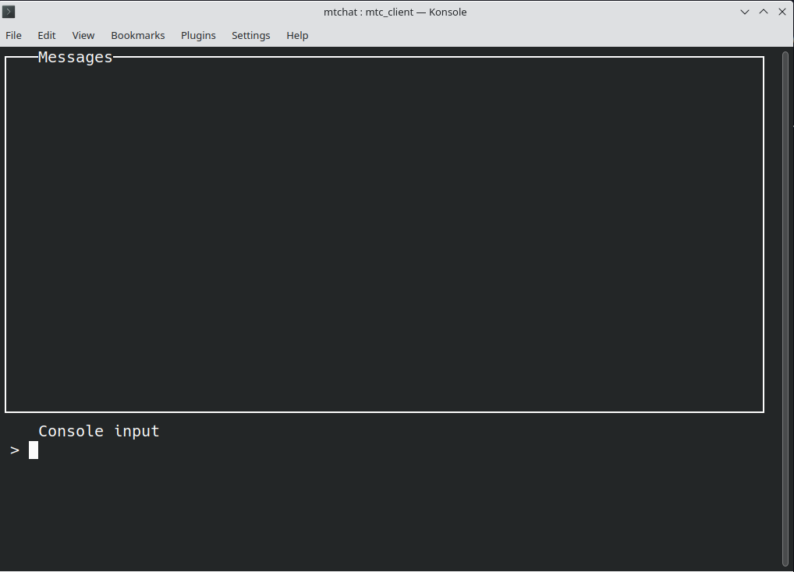
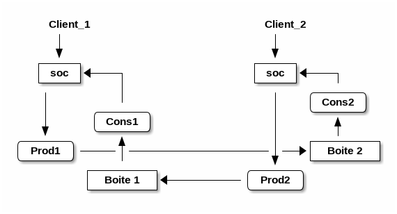

- [Instructions](#org9b0d2c8)
- [Messagerie](#orgdeb2b34)
  - [Squelette de code](#orgd108c36)
- [Première étape : serveur multi-processus](#orgc598041)
  - [Évaluation](#org3f08e5c)
- [Deuxième étape : serveur multi-thread](#orga96e18c)
  - [Suggestions](#org78ff4c7)
  - [Évaluation](#org105d6ba)
- [Troisième étape : commandes](#orgeb2e968)
  - [Suggestions](#org6a39e4a)
    - [Structure optionnelle](#org991f30f)
  - [Évaluation](#org12f104f)


<a id="org9b0d2c8"></a>

# Instructions

Le but de ce TP est d'apprendre la programmation client/serveur multi-processus et multi-threaded. À partir d'un squelette de code d'une application client/serveur minimale, vous devez implanter une application de messagerie (chat) entre plusieurs clients.

Ce TP est à rendre et il sera noté. Cette note comptera pour 40% de votre note finale. L'échéance finale pour rendre le code de votre programme est le **vendredi 12 avril 2024**.

Il est **fortement recommandé** de travailler en binôme (sauf cas exceptionnels). Les deux étudiants d'un binôme devront coder. Nous allons vérifier sur votre dépôt gitlab les messages de *commit* des deux étudiants. Si un seul de deux aura fait des *commit*, nous allons donner une note de zéro **aux deux étudiants**.

Si vous voulez travailler seul, vous devez contacter votre intervenant et justifier votre demande avec des raisons spécifiques.


<a id="orgdeb2b34"></a>

# Messagerie


<a id="orgd108c36"></a>

## Squelette de code

Le code dans le répertoire consiste des fichiers suivants :

-   <mtc_client.c> : le code du programme client ;
-   <mtc_server.c> : le code du programme serveur ;
-   <console.c> et <console.h> : le code pour l'interface terminal du client ;
-   <protocol.h> : la spécification des messages échangés entre clients et serveur ;
-   <utils.h> : des fonctions et macros d'utilité.
-   <Makefile> : le makefile

Pour compiler les deux programmes, il suffit de lancer `make`. Pour exécuter le serveur, saisissez dans un terminal la commande

    ./mtc_server <port_number>

ou `port_number` est un numéro de port, par exemple `8008`. Si vous voulez un log de tous les messages du serveur, ajoutez l'option `-v` (*verbose*) :

    ./mtc_server -v <port_number>

Pour lancer le client, dans un autre terminal saisissez la commande suivante :

    ./mtc_client <host_name> <port_number> <pseudo>

ou `host_name` est l'adresse IP4 du serveur. Si vous vous connectez sur le même ordinateur du serveur, il suffit de spécifier `localhost`. Le `port_number` doit être le même du serveur. Le `pseudo` est le nom d'affichage de ce client.

Si tout marche correctement, vous verrez sur l'écran l'image suivante :



Vous pouvez saisir un message. Après "enter", le message est envoyé au serveur, qui renvoie le même message en majuscules. En autres termes le serveur fait un *echo* des messages du client. Pour sortir, il fait saisir le message `[quit]` ou taper `CTRL-C` sur le clavier.

Si vous essayez de vous connecter avec un deuxième client, ce dernier restera bloqué jusqu'à quand le premier client aura terminé.


<a id="orgc598041"></a>

# Première étape : serveur multi-processus

Dans une première phase, on permettra au serveur de gérer plusieurs clients en même temps. Ce n'est pas encore un serveur de messagerie : chaque client verra seulement ses propres messages.

Pour faire ça, chaque fois qu'un client sera connecté, le serveur créera un processus fils qui traitera l'interaction avec ce client.

Attention : il faudra éviter les processus *zombie* ! Chaque fois qu'un client termine, le processus fils correspondant doit terminer et le processus père doit faire la `wait()` correspondant.

Cependant, il y a un problème : si le processus père est bloqué sur l'`accept()`, il n'aura pas la possibilité de faire la `wait()`. Pour résoudre ce problème, vous pouvez utiliser le signal `SIGCHLD` : si vous installez un gestionnaire de signaux pour le signal `SIGCHLD`, à chaque fois qu'un fils se termine, un signal `SIGCHLD` est envoyé au père.


<a id="org3f08e5c"></a>

## Évaluation

L'exercice est résolu lorsque vous êtes capables de démontrer (avec une démo) que :

-   plusieurs clients sont connectés en même temps au serveur ;
-   il n'y a jamais des processus zombies crée par le serveur.


<a id="orga96e18c"></a>

# Deuxième étape : serveur multi-thread

**ATTENTION** : Pour implémenter cette deuxième étape **créez un nouvelle branche sur vote dépôt gitlab**, nommé "multithread", et codez sur cette branche.

Il n'est pas facile d'implanter un programme de messagerie avec un serveur multi-processus. En effet, un processus fils n'a pas accès aux *sockets* utilisés par les autres processus et il ne peut pas directement écrire aux autres clients pour distribuer les messages.

Pour réaliser une messagerie, on change de stratégie et on utilise les *threads*.

Chaque client est géré par un thread qui attend un message du client sur son propre *socket*. De que le message est arrivé, le thread l'envoie aux autres clients en écrivant sur leurs *sockets* précédé par son pseudo. Par exemple, si le client avec pseudo `A` envoie le message `toto`, le message

    <A> : toto

est envoyé à tous les clients, y compris le client `A`.


<a id="org78ff4c7"></a>

## Suggestions

Il est donc nécessaire de préparer des structures globales où mémoriser les clients connectés avec leur *pseudo* et leur *socket*.

-   Préparez une structure ou mémoriser les informations concernant un client. Par exemple :
    
    ```c
            struct client {
                    char pseudo[PSEUDO_SIZE];
                    int socket;
                    // autres ...
            };
    ```
-   Les clients actifs seront mémorisés dans un tableau global, accessible à tous les threads. Par exemple :
    
    ```c
            struct client all_clients[MAX_CLIENTS];
    ```
-   Quand un nouveau client est connecté, le programme sélectionne une structure non encore utilisée dans le tableau, et il la remplie avec les données nécessaires. Le thread pour ce client se met en attente de nouveau messages sur le *socket* correspondant.
-   Quand un message arrive, le thread distribue le message à tous les autres clients en utilisant le tableau partagé.

**Attention** : comme le tableau est partagé, il faut le protéger avec des *mutex* !

Vous devez éviter d'utiliser des appels à `malloc`. Toutes les structures de données doivent être créés statiquement.

Vous devez éviter d'utiliser les sémaphores : pour protéger les sections critiques de code, il faut utiliser les primitives `pthread_mutex_lock()`, `pthread_mutex_unlock()`, `pthread_cond_wait()` et `pthread_cond_signal()`.


<a id="org105d6ba"></a>

## Évaluation

Vous devez nous montrer une démo où plusieurs clients se connectent au serveur et échangent des messages.

-   Il ne faut pas utiliser `malloc()` et `free()` ;
-   Il ne faut pas utiliser `sem_wait()` et `sem_post()` ;
-   Le nombre maximum de clients connecté en même temps doit être limité à `4`. Montrez que si un 5ème client essaye de se connecter, la connexion reste en attente, ou elle est refusée.

Nous allons évaluer l'utilisation correcte des *mutex* sur votre code. Toutes les structures de données partagées doivent être protégées correctement.


<a id="orgeb2e968"></a>

# Troisième étape : commandes

**ATTENTION** : Pour implémenter cette troisième étape **créez une nouvelle branche sur vote dépôt gitlab**, nommé "commandes", et codez sur cette branche.

Nous allons donner la possibilité aux clients d'envoyer des commandes aux serveurs. Les commandes sont des chaînes de caractères entre crochets `[]`.

-   Commande `[stats]` : le serveur renvoie les informations suivantes :
    
    -   date et heure de démarrage ;
    -   nombre de messages échanges ;
    -   nombre d'utilisateurs connectés.
    
    Le format précis à respecter est le suivant :
    
    -   Date en format yyyy-mm-dd
    -   Heure en format hh:mm
    -   nombre de clients en décimal.
    
    Le trois informations doivent être séparées par un espace. Par exemple :
    
        2024-03-22 10:22 7
    
    Attention à bien respecter le format !

-   Commande `[users]` : le serveur renvoie la liste des utilisateurs connectés. Il s'agit des pseudos de tous les utilisateurs connectés, séparés par des virgules. Par exemple :
    
        louis,jean,philippe,pikachu
    
    Attention à bien respecter le format !

-   Commande `[private] user` : le client passe en mode *privé* avec l'utilisateur `user` ; dorénavant, il recevra seulement les messages de `user` et il enverra ses messages qu'à `user`. Rien ne change pour l'utilisateur `user`. Si `user` n'est pas connecté, le serveur renvoie le message d'erreur suivant :
    
        [private] pikachu
    
        <SYS> Error: user pikachu not found.

-   Commande `[public]` : le client retourne en mode publique ; dorénavant, il recevra les messages de tous les utilisateurs.

-   Commande `[groupe] n` : dorénavant le client recevra les messages en groupe de `n` à la fois ; si d'autres clients lui envoie des messages (privées ou publiques), ils ne sont pas immédiatement envoyés, mais seulement après que `n` messages se sont cumulés. Par exemple, supposons qu'il y a trois clients, `A`, `B` et `C` connectés au serveur.
    
    1.  l'utilisateur `A` donne la commande `[groupe] 2` ;
    2.  l'utilisateur `B` envoie un message `M1` à tous ; le message est envoyé immédiatement à `C` qui reçoit `<B> : M1`, mais pas à `A` ;
    3.  l'utilisateur `C` envoie le message `M2` à tous ; le message est envoyé immédiatement à `B` qui reçoit `<C> : M2` ; `A` reçoit deux messages, `<B> : M1` et `<C> : M2`.
    
    La valeur maximale de `n` est `4` ; si un client spécifie `[groupe] n` avec n>4 ou n<=0, sa commande est ignorée et le serveur réponds avec le message d'erreur suivant :
    
        <SYS> Error : [groupe] parameter must be between 1 and 4. 
    
    La commande `[groupe] n` est orthogonale à la commande `[private] user`, les deux sont possibles en même temps. Pour revenir à la situation normale, l'utilisateur peut donner la commande `[groupe] 1`.


<a id="org6a39e4a"></a>

## Suggestions

Il faut faire évoluer la structure de données `struct client` pour contenir plus d'informations. Aussi, d'autres variables globales sont nécessaires pour les statistiques.

Il est toujours défendu d'utiliser `malloc()` et `free()`.


<a id="org991f30f"></a>

### Structure optionnelle

Si vous le souhaitez, il est possible (mais pas obligatoire) de changer la structure du programme pour utiliser plus d'un thread per client. Par exemple, pour chaque client il est possible de créer deux threads : un thread qui fait les lectures du socket et un thread pour faire les écritures ; vous utiliserez une structure type producteurs/consommateur avec des *boîtes à message* pour échanger entre clients. Par exemple, avec 2 clients, vous aurez la structure suivante :



Dans la figure, `Prod1` et `Cons1` sont les threads qui gèrent le client `Client 1`, et `Cons2` et `Prod2` gèrent le client `Client 2`. Les boîtes `Boite1` et `Boîte2` sert à mémoriser les messages à envoyer aux `Client1` et `Client2`, respectivement. Le thread consommateur est normalement bloqué dans l'attente d'un message sur la boîte, pendant que le thread producteur est bloqué dans l'attente d'un message sur le socket.

Avec cette structure, la commande `[groupe]` peut être implémentée facilement en réglant le nombre de messages que le consommateur doit recevoir avant de les envoyer au client.

Pour la commande `[private] user`, le producteur devra envoyer les messages seulement sur la boite correspondante à `user`.


<a id="org12f104f"></a>

## Évaluation

Faire une démo pour montrer le fonctionnement de toutes les commandes et de leurs combinaisons.

Nous allons évaluer la structure de votre code, l'utilisation des *mutex* et, si nécessaire, des variables conditions. Vous aurez des points supplémentaires si vous implémenterez la structure producteurs/consommateur.